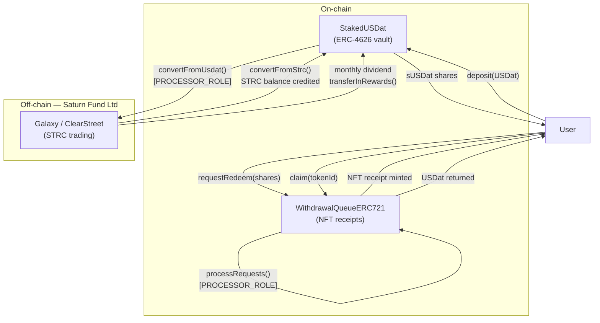
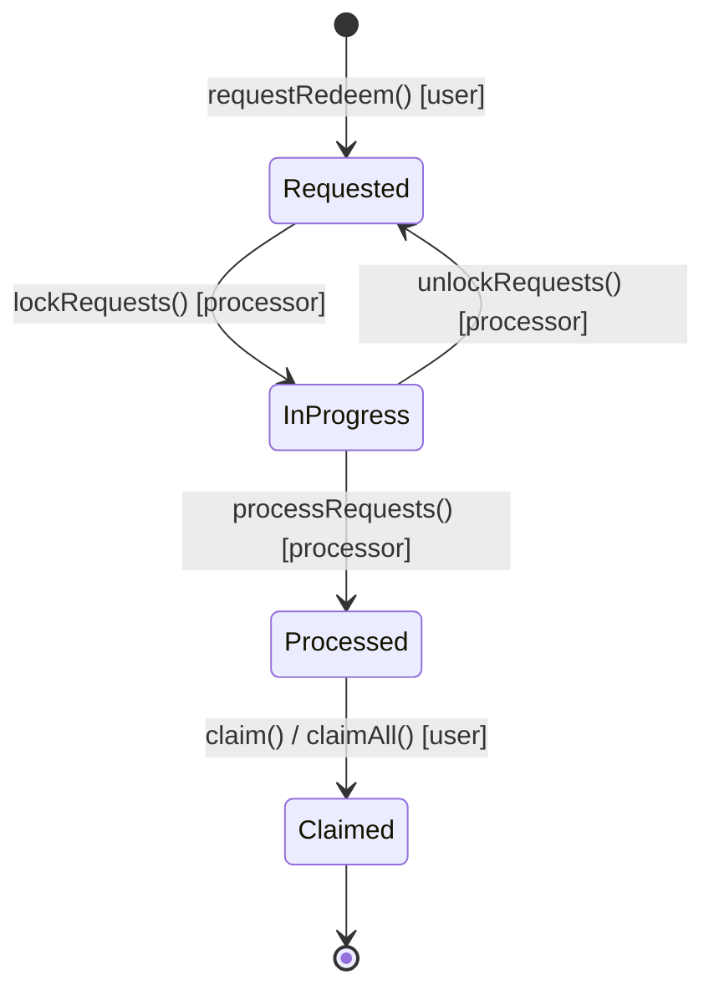

# saturn-yield-dollar — sUSDat

sUSDat is Saturn's yield-bearing stablecoin vault. Users deposit USDat (from [saturn-dollar](https://github.com/saturn-organization/saturn-dollar)) and receive sUSDat shares. The protocol rotates the USDat backing into STRC (Strategy Inc.'s variable-rate perpetual preferred stock, currently yielding ~11.5% p.a.), passing dividends through as a rising sUSDat:USDat exchange rate.

## How it works



**Share price formula:**

```
totalAssets = usdatBalance + (strcBalance_vested × strcPrice)
sharePrice  = totalAssets / sUSDat.totalSupply()
```

STRC rewards vest linearly over `vestingPeriod` (default 30 days) to smooth the monthly dividend step.

## Contracts

```
src/
├── StakedUSDat.sol              # ERC4626 vault, UUPS upgradeable
├── WithdrawalQueueERC721.sol    # NFT-based withdrawal queue, UUPS upgradeable
├── StrcPriceOracle.sol          # Chainlink wrapper with staleness + bounds checks
└── interfaces/
    ├── IStakedUSDat.sol
    ├── IWithdrawalQueueERC721.sol
    ├── IStrcPriceOracle.sol
    ├── IPriceOracle.sol
    ├── IUSDat.sol
    ├── IFreezable.sol
    └── IERC20PermitExtended.sol

script/
├── Deploy.s.sol                       # Deploy all three contracts via CreateX
├── UpgradeStakedUSDat.s.sol
├── UpgradeWithdrawalQueueERC721.s.sol
├── DeployMockOracle.s.sol             # Testnet mock oracle
├── OracleHeartbeat.s.sol              # Testnet: keep mock oracle fresh
└── README.md                          # Full deployment reference

abi/
├── StakedUSDat.json
├── WithdrawalQueueERC721.json
└── StrcPriceOracle.json
```

### StakedUSDat — key parameters

| Parameter | Default | Notes |
|---|---|---|
| Deposit fee | 10 bps (0.1%) | Capped at 500 bps; 0 = no fee |
| Vesting period | 30 days | Max 90 days; rewards vest linearly |
| Min withdrawal | 10 USDat | Hard-coded |
| Price tolerance | 20% | Acceptable deviation between execution and oracle price |
| Max rewards/transfer | 2.5% of totalAssets | Guard against oracle manipulation |
| Decimals offset | 12 | ERC4626 inflation-attack mitigation |

### StrcPriceOracle — key parameters

| Parameter | Default | Notes |
|---|---|---|
| Max staleness | 26 hours | Oracle heartbeat is 24 hrs on Ethereum; hard cap 36 hrs |
| Min price | $20 (20e8) | Sanity bound |
| Max price | $150 (150e8) | Sanity bound |
| Decimals | 8 | Chainlink-compatible |

### Roles

**StakedUSDat**

| Role | Can do |
|---|---|
| `DEFAULT_ADMIN_ROLE` | Upgrade implementation, set fees, set vesting period, unpause, redistribute blacklisted funds |
| `PROCESSOR_ROLE` | `convertFromUsdat()`, `convertFromStrc()`, `transferInRewards()` |
| `COMPLIANCE_ROLE` | Pause, blacklist/unblacklist addresses |

**WithdrawalQueueERC721**

| Role | Can do |
|---|---|
| `DEFAULT_ADMIN_ROLE` | Upgrade, unpause |
| `PROCESSOR_ROLE` | `lockRequests()`, `unlockRequests()`, `processRequests()` |
| `STAKED_USDAT_ROLE` | `addRequest()`, `claimAllFor()`, `claimBatchFor()` |
| `COMPLIANCE_ROLE` | Pause, `seizeRequests()`, `seizeBlacklistedFunds()` |

## Withdrawal queue lifecycle



Users can update `minUsdatReceived` on a `Requested` or `InProgress` position (only downward when `InProgress`). Positions can also be transferred as NFTs between wallets.

## Deployed addresses

| Network | Contract | Proxy |
|---|---|---|
| Ethereum mainnet | StakedUSDat | `0xd166337499e176bbc38a1fbd113ab144e5bd2df7` |
| Ethereum mainnet | WithdrawalQueueERC721 | see Etherscan (linked from proxy) |
| Ethereum mainnet | StrcPriceOracle | see Etherscan |
| Sepolia testnet | StakedUSDat | `0xD166337499E176bbC38a1FBd113Ab144e5bd2Df7` |
| Sepolia testnet | WithdrawalQueueERC721 | `0x4Bc9FEC04F0F95e9b42a3EF18F3C96fB57923D2e` |
| Sepolia testnet | StrcPriceOracle | `0x5f7eCD0D045c393da6cb6c933c671AC305A871BF` |

Proxy addresses are deterministic via [CreateX](https://github.com/pcaversaccio/createx) — same address on all chains for the same deployer and salt. See `script/README.md` for salt strings.

## Development

```bash
forge install
forge build
forge test
forge fmt
```

## Deployment

Set the following in `.env` (see `script/README.md` for full reference):

```bash
PRIVATE_KEY=<deployer key>
RPC_URL=<rpc endpoint>
USDAT=<USDat proxy address>
ORACLE=<Chainlink STRC oracle address>
ETHERSCAN_API_KEY=<api key>

# Optional (default to deployer if unset)
ADMIN=<admin address>
PROCESSOR=<processor address>
COMPLIANCE=<compliance address>
DEPOSIT_FEE_RECIPIENT=<fee recipient address>
```

```bash
source .env && forge script script/Deploy.s.sol \
  --rpc-url $RPC_URL --private-key $PRIVATE_KEY --broadcast
```

To upgrade implementations:

```bash
forge script script/UpgradeStakedUSDat.s.sol --rpc-url $RPC_URL --broadcast
forge script script/UpgradeWithdrawalQueueERC721.s.sol --rpc-url $RPC_URL --broadcast
```

For testnet, deploy and keep the mock oracle alive:

```bash
forge script script/DeployMockOracle.s.sol --rpc-url $RPC_URL --broadcast
MOCK_ORACLE=<address> forge script script/OracleHeartbeat.s.sol --rpc-url $RPC_URL --broadcast
```

## Dependencies

- [OpenZeppelin Contracts Upgradeable](https://github.com/OpenZeppelin/openzeppelin-contracts-upgradeable) v5 — ERC4626, ERC721, AccessControl, UUPS, Pausable
- [pcaversaccio/createx](https://github.com/pcaversaccio/createx) — deterministic cross-chain deployment

## Security

Audited by Three Sigma, Certora, and Cerotra. Reports are available on the Saturn GitBook.

Both StakedUSDat and WithdrawalQueueERC721 use `UUPSUpgradeable`. Upgrades are gated by `DEFAULT_ADMIN_ROLE`.
